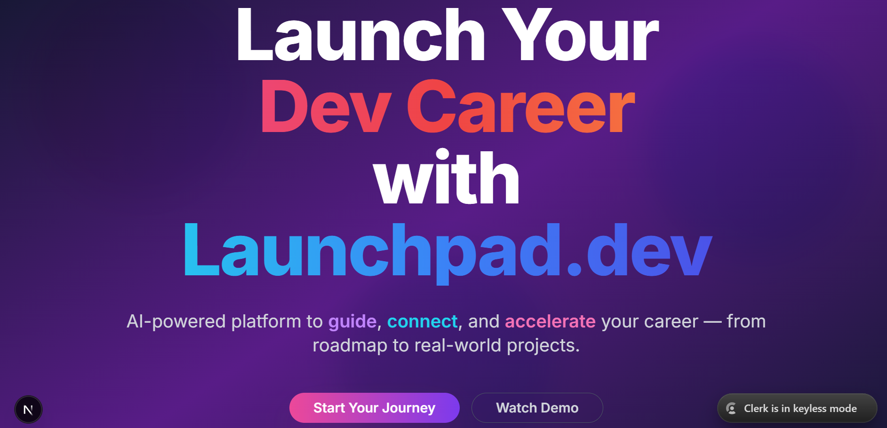
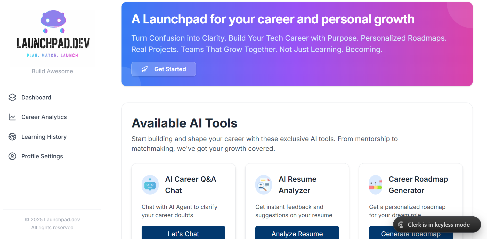
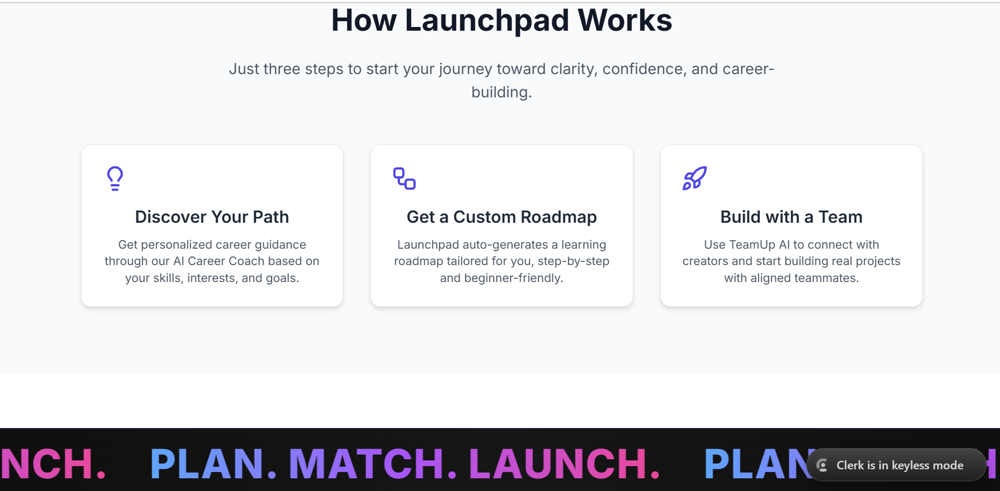
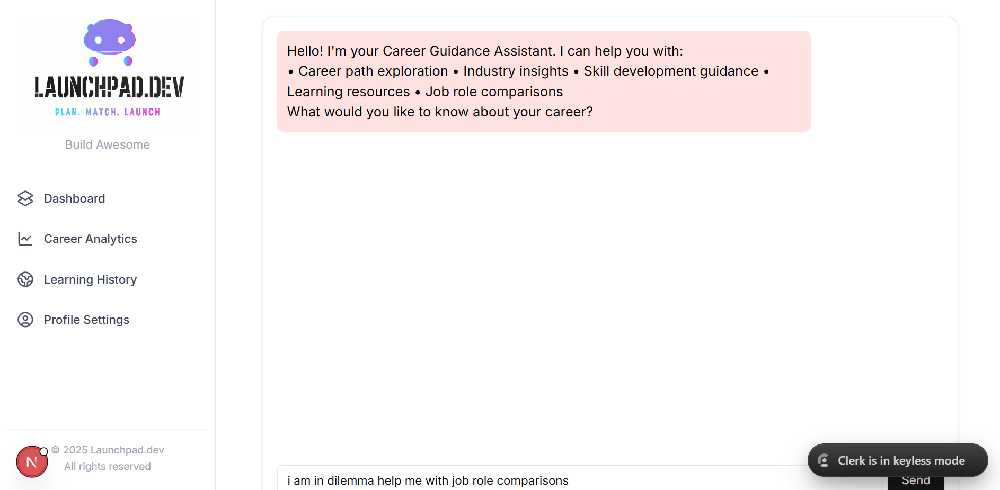
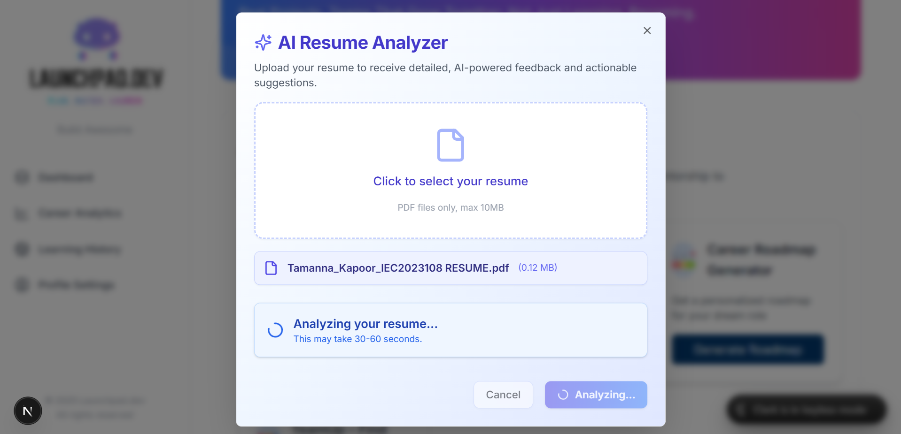
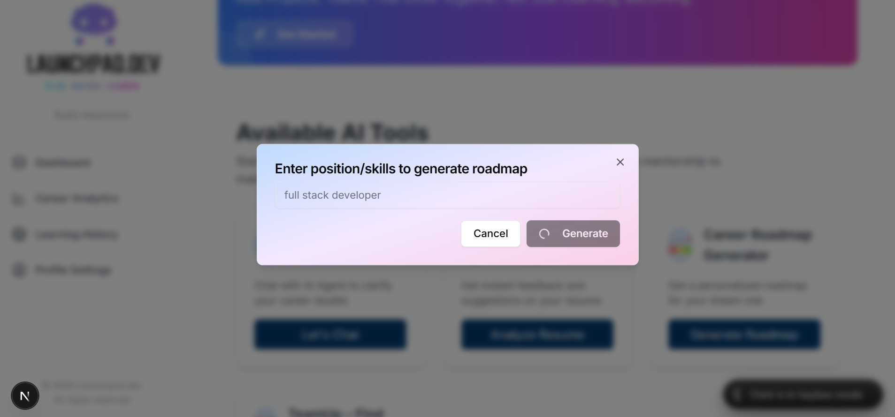
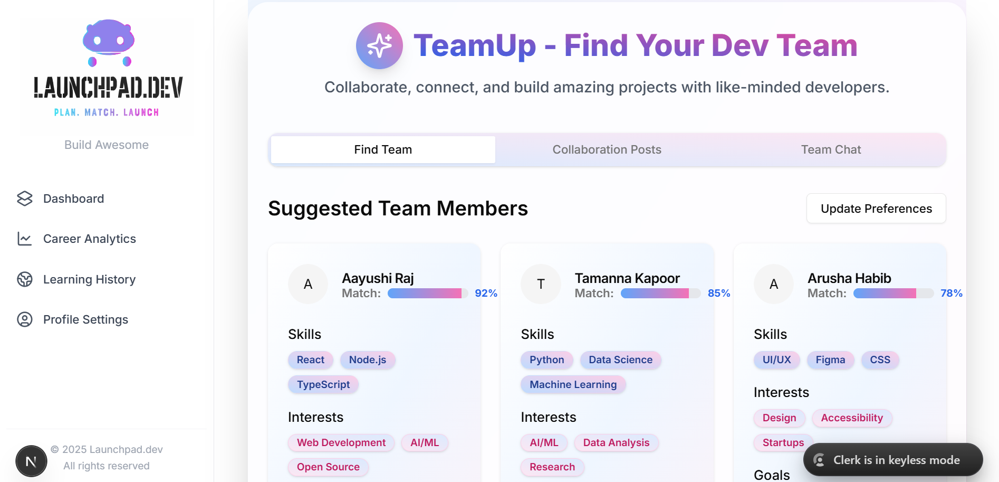

# 🚀 LaunchPad.dev – Career & Collaboration Platform

LaunchPad.dev is an AI-powered web platform designed to help students and aspiring developers gain **career clarity**, build **real-world projects**, and **collaborate with the right people**.  
It acts as a one-stop launchpad for learning, planning, and growing in tech.

---

## ✨ Features

- 🏠 Clean and intuitive landing experience
- 📊 Personalized user dashboard
- 🧭 “How It Works” guided flow for new users
- 🤖 AI Career Chat Assistant
- 📄 Resume Analyzer with actionable feedback
- 🗺️ AI-powered Roadmap Generator
- 🤝 TeamUp AI for project collaboration & matchmaking
- 🔐 Secure authentication and user management
- 📱 Fully responsive UI across devices

---

## 📸 Project Preview

### 🏠 Home Page
<p align="center">
  
</p>

### 📊 Dashboard
<p align="center">
  
</p>

### 🔍 How It Works
<p align="center">
  
</p>

### 🤖 AI Career Chat
<p align="center">
  
</p>

### 📄 Resume Analyzer
<p align="center">
  
</p>

### 🗺️ Roadmap Generator
<p align="center">
  
</p>

### 🤝 TeamUp AI
<p align="center">
  
</p>

---


This is a [Next.js](https://nextjs.org) project bootstrapped with [`create-next-app`](https://nextjs.org/docs/app/api-reference/cli/create-next-app).

## Getting Started

First, run the development server:

```bash
npm run dev
# or
yarn dev
# or
pnpm dev
# or
bun dev
```


